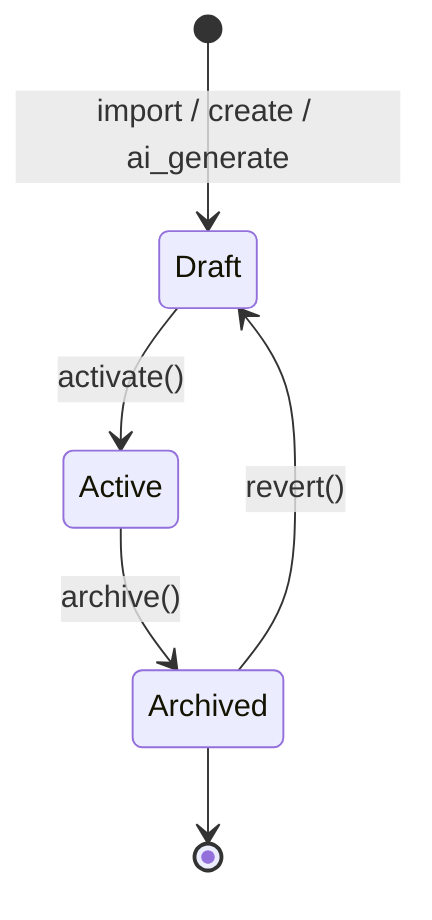

# 3. Domain Model

## 3.1 Bounded Contexts / Modules

本 feature 切成三個 context：

- **Template Context**：管理模板的領域邏輯（節點、連線、狀態）。包含 Template、Node、Connection。本 feature 主要在此 context 內運作
- **Import/Export Context**：處理模板的序列化與反序列化、placeholder 處理、ID 重新分配。依賴 Template Context
- **Validation Context**：執行 schema 與結構驗證。被 Import/Export Context 觸發

## 3.2 Entities

### Template

代表一份 Automation 模板，包含節點、連線、metadata。

**Context**: Template Context

| Field | Type | Required | Description | Constraints |
|-------|------|----------|-------------|-------------|
| id | UUID | Yes | 主鍵 | 系統生成 |
| name | String | Yes | 模板名稱 | 1-100 chars，workspace 內唯一 (BR-1) |
| description | String | No | 模板描述 | max 500 chars |
| schema_version | String | Yes | 領域模型版本號 | 例：`v0.1` |
| template_version | String | No | 模板自身版本號 | 例：`v1.0`，匯入時不繼承 |
| status | Enum | Yes | 模板狀態 | `Draft` / `Active` / `Archived` |
| workspace_id | UUID | Yes | 所屬工作區 | reference Workspace |
| created_by | UUID | Yes | 建立者 | reference User |
| created_at | Timestamp | Yes | 建立時間 | 系統生成 |
| updated_at | Timestamp | Yes | 最後更新時間 | 系統生成 |

**Relationships**:
- 1 Template has many Nodes
- 1 Template has many Connections
- 1 Template belongs to 1 Workspace

---

### Node

代表流程中的一個節點（流程卡片）。

**Context**: Template Context

| Field | Type | Required | Description | Constraints |
|-------|------|----------|-------------|-------------|
| id | UUID | Yes | 主鍵 | 系統生成 |
| template_id | UUID | Yes | 所屬模板 | reference Template |
| local_id | String | Yes | 檔案內 local ID（匯入匯出用） | 檔案內唯一，例：`node_1` |
| name | String | Yes | 節點顯示名稱 | 1-100 chars |
| position_x | Number | Yes | 畫布 X 座標 | — |
| position_y | Number | Yes | 畫布 Y 座標 | — |
| task_template_ref | UUID | No | 外部 Task 模板引用 | POC 階段固定為 null (D-0001) |
| fields | JSON | Yes | 欄位定義陣列 | 內嵌；POC 階段必填 |
| assignees | JSON | Yes | 執行人 placeholder 陣列 | 不帶具體 user_id (BR-3) |
| field_permissions | JSON | No | 欄位操作權限 | 未列出的 field 預設 edit |

**Node.fields 結構**（內嵌）：
```json
[
  {
    "field_key": "string，本節點內唯一",
    "field_name": "string，顯示名稱",
    "field_type": "enum: text | number | date | select | multi_select | checkbox | file",
    "field_options": "array，僅 select 類型",
    "is_required": "boolean"
  }
]
```

**Node.assignees 結構**：
```json
[
  {
    "placeholder_type": "enum: role | variable",
    "placeholder_key": "string，例：'approver'",
    "display_name": "string，例：'審核人'"
  }
]
```

---

### Connection

代表兩個節點之間的連線，帶觸發條件。

**Context**: Template Context

| Field | Type | Required | Description | Constraints |
|-------|------|----------|-------------|-------------|
| id | UUID | Yes | 主鍵 | 系統生成 |
| template_id | UUID | Yes | 所屬模板 | reference Template |
| local_id | String | Yes | 檔案內 local ID | 檔案內唯一 |
| source_node_id | UUID | Yes | 來源節點 | reference Node |
| target_node_id | UUID | Yes | 目標節點 | reference Node，**不可等於 source** (BR-4) |
| logic_operator | Enum | Yes | 條件邏輯運算子 | `AND` / `OR` |
| conditions | JSON | Yes | 條件陣列 | 引用 source 節點的 fields |

**Connection.conditions 結構**：
```json
[
  {
    "field_key": "string，引用 source_node_id 的 field_key",
    "operator": "enum: eq | neq | contains | not_contains | between | not_between",
    "value": "any，依 field_type 而定"
  }
]
```

---

### 完整 JSON Schema（匯出 / 匯入格式）

> 此為 Template + Nodes + Connections 序列化為單檔的格式。對應 §6 的 API 也使用此格式。

```json
{
  "$schema": "https://example.com/automation-template/v0.1.json",
  "schema_version": "0.1",
  "metadata": {
    "name": "string",
    "description": "string | null",
    "exported_at": "ISO 8601 timestamp",
    "exported_from": "string",
    "template_version": "string"
  },
  "nodes": [
    {
      "node_id": "string，檔案內唯一",
      "name": "string",
      "position": { "x": "number", "y": "number" },
      "task_structure": {
        "task_template_ref": "string | null (POC 固定 null)",
        "fields": [ /* Node.fields 結構 */ ]
      },
      "assignees": [ /* Node.assignees 結構 */ ],
      "field_permissions": [
        { "field_key": "string", "permission": "enum: edit | view" }
      ]
    }
  ],
  "connections": [
    {
      "connection_id": "string，檔案內唯一",
      "source_node_id": "string",
      "target_node_id": "string",
      "logic_operator": "enum: AND | OR",
      "conditions": [ /* Connection.conditions 結構 */ ]
    }
  ]
}
```

## 3.3 State Machines

### Template State Transitions



| From | To | Trigger | Guard | Side Effects |
|------|----|---------|---------|-------------|
| (none) | Draft | `import()` / `create()` / `ai_generate()` | 通過 schema 驗證 | 寫入 DB；發出 TemplateImported / TemplateCreated 事件 |
| Draft | Active | `activate()` | 至少 1 個 Node | 發出 TemplateActivated 事件 |
| Active | Archived | `archive()` | — | 暫停所有相關 task instances（已執行的 instance 繼續跑完） |
| Archived | Draft | `revert()` | 操作者具 admin 權限 | — |

## 3.4 Business Rules / Invariants

| ID | Rule | Scope | Enforcement |
|----|------|-------|-------------|
| BR-1 | Template name 在同一 workspace 內必須唯一（大小寫敏感） | Template | DB unique constraint + application check |
| BR-2 | 匯入檔案的 schema_version 必須是系統支援的版本 | Import | Application validation |
| BR-3 | Assignees 不可帶具體 user_id，必須是 placeholder | Template (export/import) | Application logic on serialization |
| BR-4 | Connection 的 source_node_id 不可等於 target_node_id（禁止節點自連） | Connection | Application validation on import |
| BR-5 | Connection 的 conditions 引用的 field_key 必須在 source 節點存在 | Connection | Application validation on import |
| BR-6 | 模板總檔案大小不可超過 5 MB | Import | Application check before parse |
| BR-7 | 匯入後 Template 預設 status = Draft，不可直接 Active | Template | State machine guard |
| BR-8 | 匯入過程任何失敗，不可留下半成品資料 | Import | DB transaction (atomicity) |

## 3.5 Domain Events

| Event | Triggered When | Payload | Consumers |
|-------|----------------|---------|-----------|
| TemplateImported | Template 從匯入路徑寫入成功 | template_id, workspace_id, imported_by, source (file/ai/seed) | Audit log |
| TemplateExported | 使用者觸發匯出 | template_id, exported_by | Audit log |
| TemplateActivated | Template Draft → Active | template_id, activated_by | （未來通知 / 搜尋索引） |
| TemplateArchived | Template Active → Archived | template_id, archived_by | （未來通知） |
| SeedTemplateLoadFailed | 系統啟動載入 seed 檔案失敗 | file_path, error | RD log monitoring |

> 對外發布的事件細節（channel、schema、retention）見 §6.4.1。
