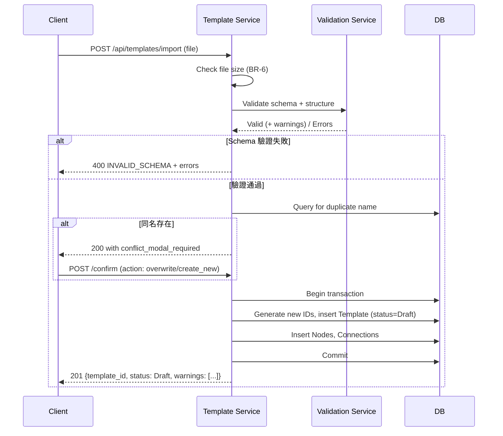
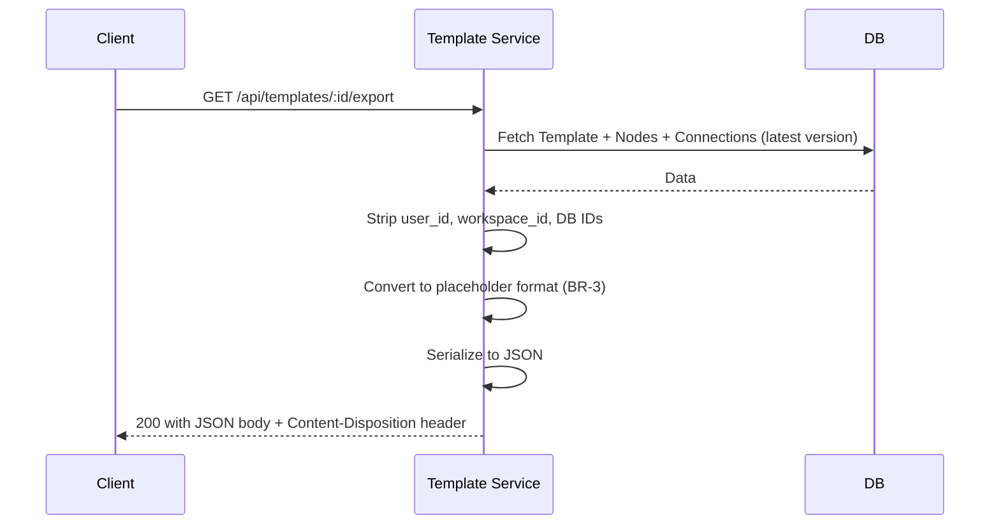
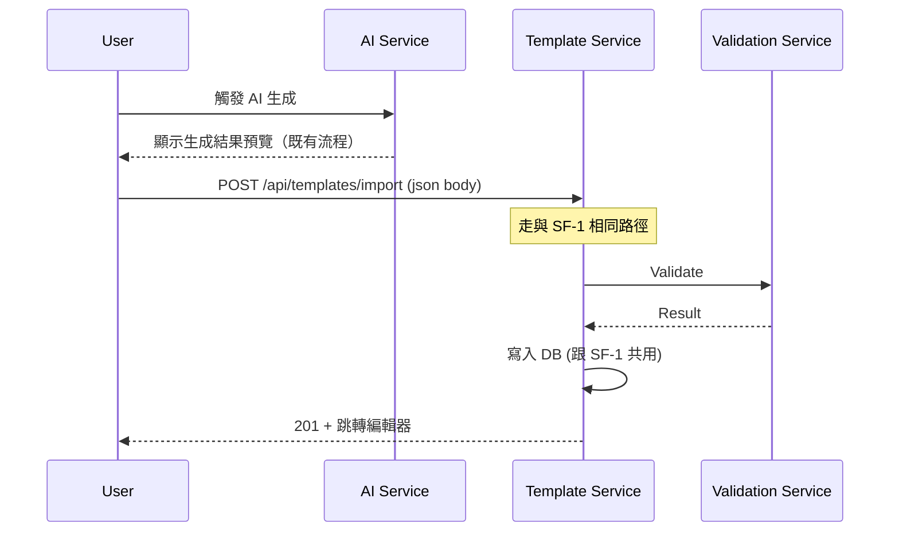
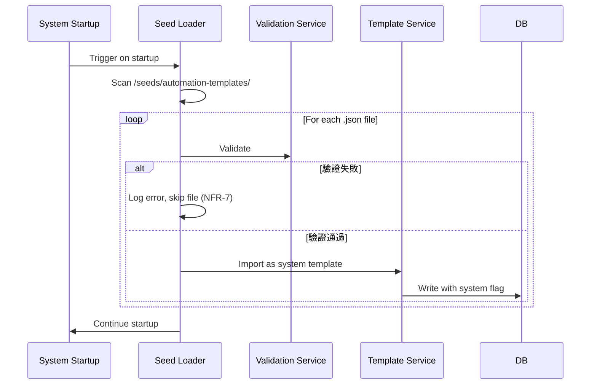

# 4. System Flows

## 4.1 System Flows

### SF-1: 從檔案匯入模板

**Related FR**: FR-2, FR-3, FR-4, FR-5, FR-6
**Related UF**: UF-1（見 §5.3）
**Components involved**: Template Service, Validation Service, DB

**Key steps**:
1. **檔案大小檢查**：超過 5 MB 直接拒絕（BR-6, EF-2）
2. **Schema 驗證**：呼叫 Validation Service 做 schema + 結構驗證，含 BR-2, BR-4, BR-5
3. **結構警告**：孤兒節點、多重連線等不擋匯入，附在 response 的 warnings 中（FR-9）
4. **同名檢查**：偵測到同名跳出 Modal 流程（EC-1）
5. **Atomic 寫入**：在單一 transaction 內建立 Template + Nodes + Connections，任何失敗 rollback
6. **ID 重新分配**：檔案內的 local_id 在 DB 端產生對應的真實 UUID
7. **預設 Draft 狀態**：對應 BR-7

---

### SF-2: 匯出模板為檔案

**Related FR**: FR-1
**Related UF**: UF-5
**Components involved**: Template Service, DB

**Key steps**:
1. **僅匯出最新版本**：不含版本歷史
2. **清理資料**：移除真實 user_id、workspace_id、DB ID（NFR-4）
3. **Placeholder 轉換**：assignees 從具體成員轉為 placeholder（保留 display_name 提示）
4. **檔名生成**：`{template_name}_{YYYYMMDD}.json` 透過 Content-Disposition header
5. **觸發事件**：發出 TemplateExported（§3.5）

---

### SF-3: AI 生成結果寫入

**Related FR**: FR-7
**Related UF**: UF-2
**Components involved**: AI Service, Template Service, Validation Service, DB

**Key steps**:
1. **共用 import 路徑**：AI 生成的 JSON 走 SF-1 的後半段，差別只是來源（file vs in-memory JSON）
2. **同樣驗證**：AI 也可能產生不合法結構，驗證不可跳過
3. **失敗處理**：若 schema 驗證失敗，視為「生成失敗」走既有 AI 失敗流程（扣點規則由 AI 模組決定）

---

### SF-4: Seed 模板載入（系統啟動時）

**Related FR**: FR-8
**Related UF**: UF-6
**Components involved**: Seed Loader, Template Service, Validation Service, DB

**Key steps**:
1. **不阻擋啟動**：任何 seed 檔案失敗都不阻擋系統啟動（NFR-7）
2. **共用驗證**：跟 SF-1 用同樣的 Validation Service
3. **系統旗標**：載入的模板標記為系統內建（與一般使用者模板區分）
4. **失敗 log**：對應 SeedTemplateLoadFailed 事件，方便 RD 排查

## 4.2 Error & Exception Flows

### EF-1: Schema 驗證失敗

**Triggers in**: SF-1 step 2, SF-3 step 3, SF-4 中每個檔案的驗證
**Detection**: Validation Service 回傳 invalid 含 error list

**System behavior**:
1. 不建立任何 Template / Node / Connection
2. 回傳 400 INVALID_SCHEMA
3. Response body 包含具體錯誤位置與訊息（例：`path: "/nodes/0/name", error: "required"`）
4. 對 SF-4（seed 載入）：log error + skip file，不阻擋啟動

**Recovery**: 使用者修正檔案後重新上傳；RD 修正 seed 檔案後重啟系統

---

### EF-2: 檔案大小超過限制

**Triggers in**: SF-1 step 1（檔案上傳階段）
**Detection**: Multipart parser 偵測到 size > 5 MB

**System behavior**:
1. 不執行 schema 驗證（短路）
2. 回傳 400 FILE_TOO_LARGE
3. Error message: `[檔案大小超過 5 MB，請聯繫管理員]`

**Recovery**: 使用者縮減檔案內容或聯繫管理員

---

### EF-3: 節點自連禁止

**Triggers in**: SF-1 step 2（在 Validation Service 內）
**Detection**: 任一 connection 的 source_node_id == target_node_id（違反 BR-4）

**System behavior**:
1. Validation Service 回傳 invalid
2. 走 EF-1 流程，error code: INVALID_STRUCTURE
3. Response 標明：`偵測到節點自連：{node_id}`

**Recovery**: 修正檔案

---

### EF-4: Connection 引用不存在的 field

**Triggers in**: SF-1 step 2
**Detection**: condition.field_key 在 source 節點的 fields 中找不到（違反 BR-5）

**System behavior**:
1. Validation Service 回傳 invalid
2. 走 EF-1 流程，error code: INVALID_REFERENCE
3. Response 標明：`條件引用了不存在的欄位：{field_key}`

**Recovery**: 修正檔案

---

### EF-5: 匯入 DB 寫入失敗

**Triggers in**: SF-1 step 5 (transaction commit)
**Detection**: DB transaction 失敗（連線中斷、constraint violation 等）

**System behavior**:
1. Transaction rollback，不留半成品（BR-8）
2. 回傳 500 INTERNAL_ERROR
3. Log 詳細錯誤
4. Trigger alert（§9.4）

**Recovery**: 使用者重試；若持續失敗 oncall 介入

---

### EF-6: 匯出時模板無任何節點

**Triggers in**: SF-2 step 1（fetch 階段）
**Detection**: Template 有但 Nodes 為空

**System behavior**:
1. 回傳 422 EMPTY_TEMPLATE
2. Error message: `[模板尚未建立任何節點，無法匯出]`

**Recovery**: 使用者先在編輯器建立節點

## 4.3 Edge Cases

### EC-1: 匯入時偵測到同名模板

**Scenario**: 匯入檔案的 metadata.name 在當前 workspace 內已存在（大小寫敏感）

**Handling**:
- 不直接拒絕、也不直接覆蓋
- 預覽頁顯示模板資訊後，使用者點「確認匯入」時跳出選擇 Modal：
  - **覆蓋既有**：替換目標模板內容，**儲存為該模板的新版本**（v1 → v2），原版本保留
  - **建立新的**：建立全新模板，名稱自動加 suffix（例：「訂單流程 (2)」）
  - **取消**：不寫入
- 覆蓋的情況下：執行中的 task instance 繼續跑舊版完成，新觸發的走新版（沿用既有切換啟用版本規則）
- 覆蓋後新版本預設為 Draft，需明確啟用

---

### EC-2: 匯入後存在未對應的 Assignee placeholder

**Scenario**: 模板匯入後 assignees 是 placeholder，使用者尚未指派具體成員

**Handling**:
- 不阻擋匯入
- 預覽頁列出「待對應項目」清單
- 使用者啟用模板前若仍有未對應的 placeholder，跳出**軟提示** Modal：
  - `啟用前確認：有 {N} 個執行人 placeholder 尚未指派，啟用後相關節點觸發時將無法派發 task`
  - 按鈕：「取消」/「仍要啟用」
- 軟提示不阻擋啟用

---

### EC-3: 孤兒節點（節點數 > 1 且存在未連線節點）

**Scenario**: 模板包含未連線的節點，但非單一節點模板

**Handling**:
- 允許匯入，**不阻擋**
- 預覽頁顯示警告：`偵測到 {N} 個未連線節點：{node_names}，匯入後請補上連線`
- 警告附在 import API response 的 warnings 陣列中

---

### EC-4: 同兩節點間多條連線

**Scenario**: 節點 A 與 B 之間有 2 條以上 connection

**Handling**:
- 允許匯入，不阻擋
- 預覽頁顯示警告：`偵測到節點「{A}」與「{B}」之間有 {N} 條連線，請確認是否為刻意設計（建議改用 OR 條件合併）`

---

### EC-5: 環狀連線

**Scenario**: 模板存在 A → B → C → A 這種環狀結構

**Handling**:
- 完全放行，**不擋亦不警告**
- 業務上常見合理場景（例：審核退回重審）

---

### EC-6: 單一節點模板

**Scenario**: 模板只有 1 個節點，沒有任何 connection

**Handling**:
- 合法的初始狀態，不視為孤兒
- 完全放行，不警告

---

### EC-7: 重複匯入同一檔案

**Scenario**: 使用者短時間內多次點擊「確認匯入」按鈕

**Handling**:
- Client 端：按鈕點擊後立即 disable，直到 response 回來
- Server 端：Header 接受 `X-Idempotency-Key`，相同 key 在 5 分鐘內視為同一筆，回傳第一次的結果
- 若無 idempotency key，依然走完整流程（可能建立兩筆同名模板，由 EC-1 處理）

## 4.4 Concurrency & Ordering

回答三個觸發問題：

1. **共享資源**：✓ 是
   - Template name 在 workspace 內唯一（BR-1）
   - **處理**：DB unique constraint + application 層在 import 前先檢查（雙重保險）

2. **事件順序**：✓ 有
   - Import 流程中：先建 Template → 再建 Nodes → 最後建 Connections（Connection reference Nodes，順序不可逆）
   - **處理**：DB transaction 內依序執行；transaction 失敗整批 rollback（BR-8）

3. **重複觸發**：✓ 是
   - 使用者可能多次點擊「確認匯入」（EC-7）
   - AI 生成的 retry 可能重投
   - Seed 載入若系統重啟可能重跑
   - **處理**：
     - Import API 接受 `X-Idempotency-Key`，5 分鐘內去重
     - Seed 載入：對相同檔名 + 內容 hash 做去重，已載入過的 skip
